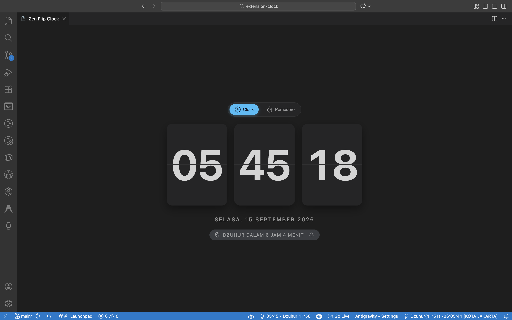

# ⏰ Zen Clock: Pomodoro & Jadwal Sholat (Ekstensi Browser)

<p align="center">
  
</p>

<p align="center">
  <b>Jam mekanik 3D retro flip, timer Pomodoro latar belakang yang tidak pernah freeze, dan jadwal sholat otomatis standar Kemenag RI untuk Google Chrome & Microsoft Edge.</b>
</p>

<p align="center">
  <a href="./README.md">English</a> | <b>Bahasa Indonesia</b>
</p>

<p align="center">
  
  
  
  
  
</p>

---

## 🌟 Fitur Utama

### 🕰️ 1. 3D Zen Flip Clock
- Jam mekanik 3D retro-modern dengan animasi kartu lipat halus di Action Popup toolbar.
- Tampilan tanggal dinamis berbahasa Indonesia.
- **Mode Jam Meja Layar Penuh (Desk Clock)**: Klik ikon pop-out untuk membuka tab penuh jam mekanik (`clock.html`).

### 🍅 2. Timer Pomodoro Background Mandiri
- **Anti Freeze**: Ditenagai oleh **Service Worker (Manifest V3)** menggunakan `chrome.alarms`. Timer tetap berdetak akurat di background walau popup ditutup atau saat berpindah-pindah tab web.
- **Badge Toolbar**: Menampilkan sisa menit langsung di ikon ekstensi toolbar browser (misal: `24m` warna kuning saat kerja, `04m` warna hijau saat istirahat).
- **Notifikasi Desktop Native**: Peringatan dialog saat sesi kerja atau istirahat berakhir.

### 🕌 3. Jadwal Sholat Otomatis Standar Kemenag RI
- Perhitungan waktu sholat astronomi presisi via [`adhan`](https://github.com/batoulapps/adhan-js).
- **Parameter Resmi Kemenag RI**:
  - Sudut Subuh: **20°**, Sudut Isya: **18°**
  - Madhab: **Syafi'i**
  - Pembulatan: **Ke Atas (Rounding Up)**
  - Ihtiyat (pengaman): **+2 menit** pada seluruh waktu sholat (Terbit: -2m).
- **Penyesuaian Otomatis Sholat Jum'at**: Setiap hari Jumat, penamaan waktu sholat Dzuhur otomatis berganti menjadi **"Jum'at"**.
- **Koreksi Menit Sholat**: Menu pengaturan offset (+/- menit) per jadwal sholat dengan tombol 1-klik Reset ke standar Kemenag RI.

### 📖 4. Halaman Pengingat Sholat Tenang Khusus (Reminder Tab)
- Halaman tab khusus (`reminder.html`) dengan atmosfer gelap estetik, info waktu sholat wilayah Anda, dan kutipan ayat Al-Qur'an (*QS. An-Nisa': 103*).
- **Pengaturan Fleksibel**: Pengguna dapat memilih apakah tab otomatis terbuka saat waktu sholat tiba (`autoOpenReminderTab: true`) atau hanya memunculkan notifikasi desktop saja.

### 🎨 5. 6 Warna Aksen Tema & Kustom HEX
- 6 preset warna pilihan: **Warm Amber** (Bawaan), **Islamic Emerald**, **Modern Sky Cyan**, **Pomodoro Rose**, **Mystic Purple**, dan **Monochrome Silver**.
- Dukungan kode warna HEX kustom dengan kalkulasi otomatis kontras teks.

### 📍 6. Pemilih Kota & Smart Geolocation
- Pilihan kota populer di Indonesia (Jakarta, Bandung, Surabaya, Medan, dll.) dan pencarian kota global.
- Fallback deteksi lokasi otomatis via IP.

---

## 🛠️ Panduan Pengembangan & Pemasangan

### Pemasangan Developer (Load Unpacked)

1. Clone repositori ini:
   ```bash
   git clone https://github.com/lutfialdrii/extension-browser-zen-clock.git
   cd extension-browser-zen-clock
   ```
2. Pasang dependensi:
   ```bash
   npm install
   ```
3. Kompilasi untuk produksi:
   ```bash
   npm run build
   ```
4. Pasang ke browser:
   - **Google Chrome**: Buka `chrome://extensions`, aktifkan **Developer mode** (pojok kanan atas), klik **Load unpacked**, dan pilih folder `dist/`.
   - **Microsoft Edge**: Buka `edge://extensions`, aktifkan **Developer mode** (kiri bawah), klik **Load unpacked**, dan pilih folder `dist/`.

---

## 📦 Pemaketan Rilis Web Store

```bash
npm run package:zip
```
Perintah ini akan mengompilasi dan mengompres folder `dist/` ke dalam berkas arsip `releases/extension-browser-zen-clock-0.0.1.zip` yang siap diunggah ke **Chrome Web Store** dan **Microsoft Edge Add-ons**.

---

## 📄 Lisensi

Proyek ini dilisensikan di bawah [Lisensi MIT](./LICENSE).

---

Dibuat dengan sepenuh hati oleh [lutfialdrii](https://github.com/lutfialdrii).
