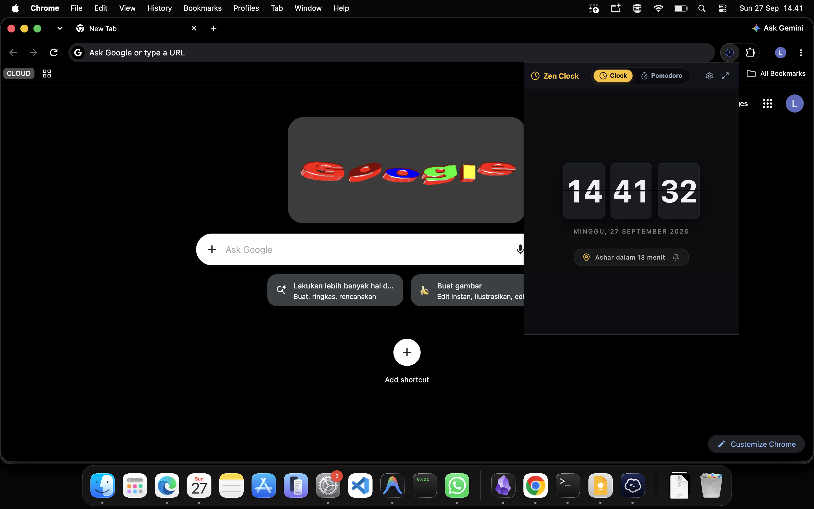
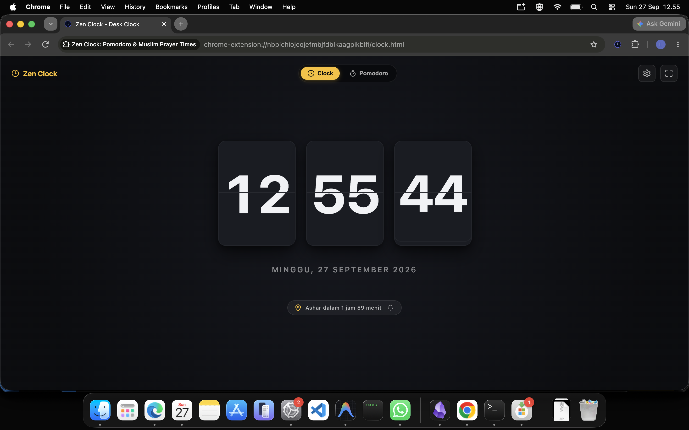
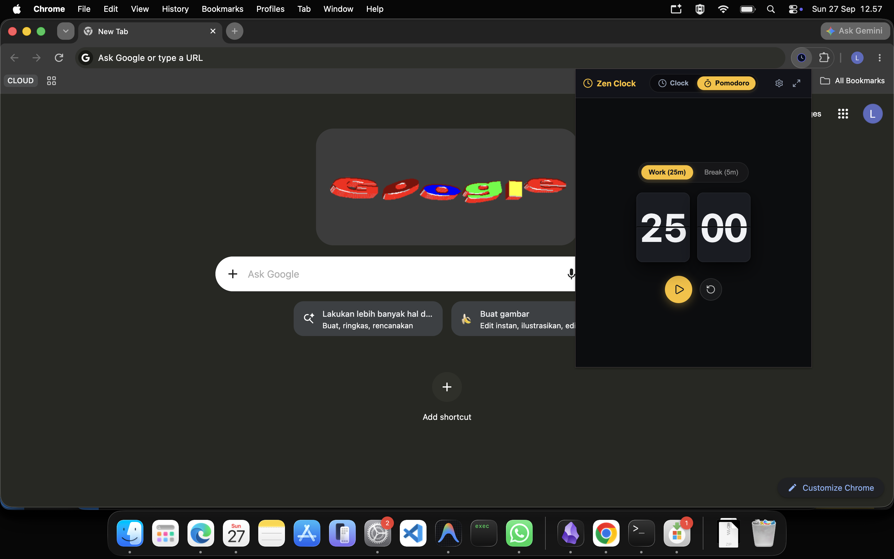
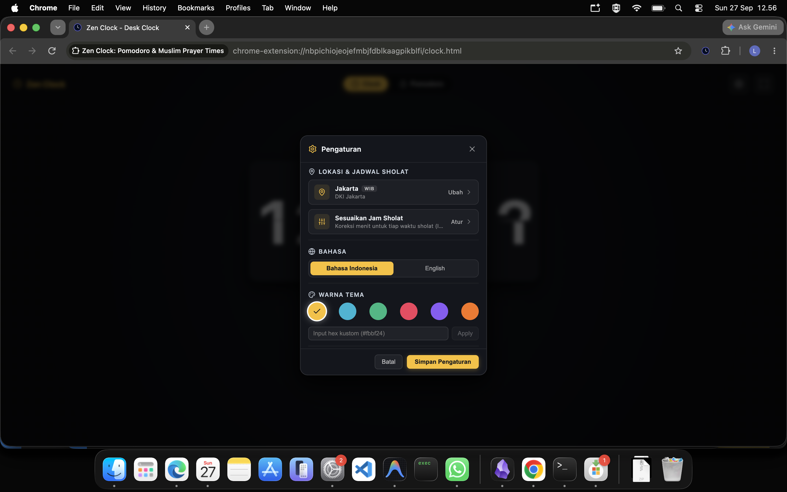
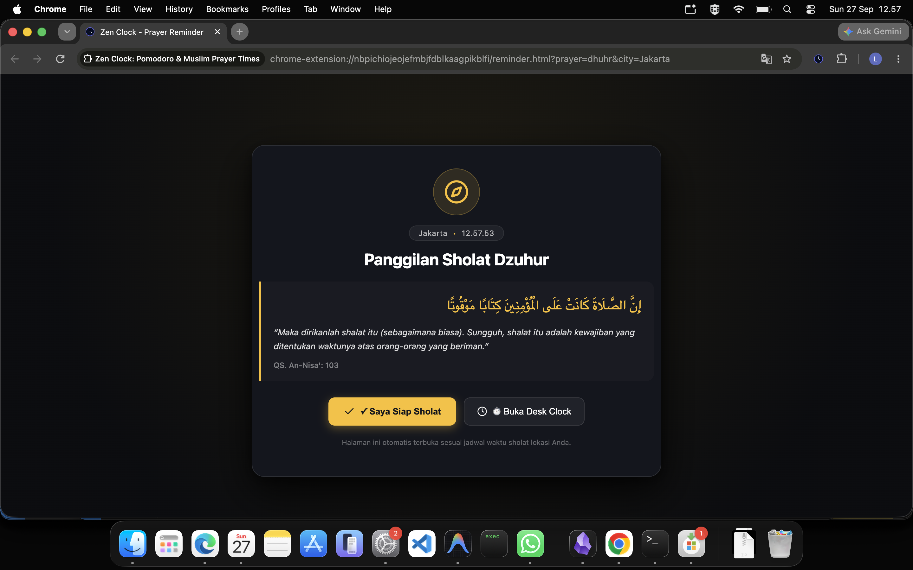

# ⏰ Zen Clock: Pomodoro & Muslim Prayer Times (Browser Extension)

<p align="center">
  
</p>

<p align="center">
  <b>A mindful 3D retro mechanical flip clock, true background Pomodoro timer, and automated Muslim prayer times with Kemenag RI standards for Google Chrome & Microsoft Edge.</b>
</p>

<p align="center">
  <b>English</b> | <a href="./README.id.md">Bahasa Indonesia</a>
</p>

<p align="center">
  
  
  
  
  
</p>

---

## 🌟 Key Features

### 🕰️ 1. 3D Zen Flip Clock
- Minimalist, distraction-free retro mechanical flip clock in an Action Popup.
- Smooth CSS 3D card folding transitions and localized date display.
- **Fullscreen Desk Clock Mode**: Click the pop-out icon to open a dedicated full-tab desk clock (`clock.html`).

### 🍅 2. True Background Pomodoro Engine
- **Immune to Closing/Minimizing**: Powered directly by the **Service Worker (Manifest V3)** background process with `chrome.alarms`. The timer continues ticking accurately even when the popup is closed or when you browse different websites.
- **Toolbar Badge Counter**: Displays remaining minutes directly on your browser extension toolbar icon (e.g. `24m` in Amber for work, `04m` in Emerald for break).
- **Native OS Desktop Notifications**: Native dialogs upon work/break completion to help you stay on track.

### 🕌 3. Automated Islamic Prayer Times (Kemenag RI Standard)
- Accurate astronomical prayer calculation powered by [`adhan`](https://github.com/batoulapps/adhan-js).
- **Official Kemenag RI Parameters**:
  - Fajr angle: **20°**, Isha angle: **18°**
  - Madhab: **Shafi'i**
  - Rounding: **Rounding Up**
  - Ihtiyat (safety buffer): **+2 minutes** on all prayer times (Sunrise: -2m).
- **Automatic Friday "Jum'at" Label**: Every Friday, Dhuhr is automatically displayed as **"Jum'at"**.
- **Interactive Time Adjustments**: Easily fine-tune minute offsets per prayer time (+/- minutes) with a 1-click Reset to Kemenag RI standard.

### 📖 4. Dedicated Peaceful Prayer Reminder Tab
- A peaceful, serene tab (`reminder.html`) with a dark obsidian atmosphere, local prayer timing, and inspirational Quranic quote (*QS. An-Nisa: 103*).
- **Parameterized Setting**: Configure whether the tab automatically opens at adzan time (`autoOpenReminderTab: true`) or triggers subtle desktop notifications only.

### 🎨 5. 6 Theme Accents & Custom HEX
- 6 curated aesthetic themes: **Warm Amber** (Default), **Islamic Emerald**, **Modern Sky Cyan**, **Pomodoro Rose**, **Mystic Purple**, and **Monochrome Silver**.
- Custom HEX color input with automated contrast detection.

### 📍 6. Smart Geolocation & City Selector
- Curated list of popular Indonesian cities (Jakarta, Bandung, Surabaya, Medan, etc.) and global city search.
- Automatic IP geolocation fallback.

---

## 📸 Interface Gallery

### 1. Action Popup & Desk Clock View
| 📌 Action Popup (380px) | 📑 Fullscreen Desk Clock Tab |
| :---: | :---: |
|  |  |
| *Compact floating widget from your browser toolbar.* | *Immersive mechanical flip clock for dedicated desk display.* |

### 2. Pomodoro Timer & Theme Customization
| 🍅 2-Card Pomodoro Timer Engine | 🎨 Theme Accent Color Presets |
| :---: | :---: |
|  |  |
| *2-card flip timer synchronized with background service worker.* | *Curated palettes + custom HEX code input.* |

### 3. Peaceful Prayer Reminder Tab
| 🕌 Auto-Opening Prayer Reminder Tab |
| :---: |
|  |
| *Calming tab that opens at adzan time with local timing and inspirational Quranic verses.* |

---

## 🛠️ Development & Installation

### Option 1: Load Unpacked in Chrome or Edge (Developer Mode)

1. Clone this repository:
   ```bash
   git clone https://github.com/lutfialdrii/zen-clock-extension-browser.git
   cd zen-clock-extension-browser
   ```
2. Install dependencies:
   ```bash
   npm install
   ```
3. Build for production:
   ```bash
   npm run build
   ```
4. Load into your browser:
   - **Google Chrome**: Open `chrome://extensions`, enable **Developer mode** (top right), and click **Load unpacked**. Select the `dist/` folder.
   - **Microsoft Edge**: Open `edge://extensions`, enable **Developer mode** (bottom left), and click **Load unpacked**. Select the `dist/` folder.

### Option 2: Development with Hot Module Replacement (HMR)

```bash
npm run dev
```
Make changes to components or styles in `src/`, and the extension in Chrome/Edge will update in real-time thanks to `@crxjs/vite-plugin`.

---

## 📦 Packaging for Web Store Release

```bash
npm run package:zip
```
This builds and packages the extension into `releases/extension-browser-zen-clock-1.0.0.zip`, ready for submission to the **Chrome Web Store Developer Dashboard** and **Microsoft Partner Center (Edge Add-ons)**.

For complete developer dashboard submission metadata, category selection, and permissions justification text, see our [Chrome Web Store Submission Guide](./CHROMEWEBSTORE.md).

---

## 🔒 Privacy, Security & Offline-First Pledge

Zen Clock is built with privacy-by-design at its core:
- **Zero Data Collection**: No personally identifiable information (PII) is collected, stored remotely, or transmitted.
- **Client-Side Astronomy**: Astronomical prayer times are computed mathematically directly on your device via the official Kemenag RI formula.
- **Zero Trackers & Zero Ads**: No Google Analytics, telemetry, cookies, or remote tracking scripts.
- **Minimalist Permissions**: Only 3 standard permissions declared (`storage`, `alarms`, `notifications`), with **zero** host permissions.

For full details, read our complete [Privacy Policy](./PRIVACY.md).

---

## 💖 Support the Creator

Zen Clock is completely free, open-source, and ad-free. If this extension brings peace and focus to your daily workflow, consider supporting its continuous development:

- ☕ **Saweria**: [saweria.co/lutfialdrii](https://saweria.co/lutfialdrii) (GoPay, OVO, Dana, QRIS)
- ⭐ **Star on GitHub**: Give this repository a star to help more people discover Zen Clock!

---

## 📄 License

This project is licensed under the [MIT License](./LICENSE).

---

Crafted with care by [lutfialdrii](https://github.com/lutfialdrii).
