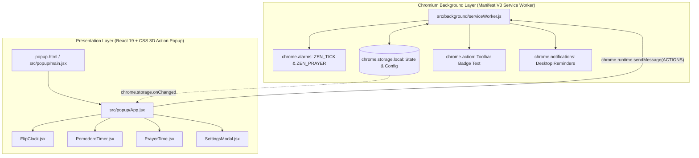

# Arsitektur Zen Clock: Chromium Manifest V3 Browser Extension

Dokumen ini menjelaskan arsitektur teknis dari ekstensi **Zen Clock: Pomodoro & Muslim Prayer Times** untuk browser berbasis Chromium (**Google Chrome, Microsoft Edge, Brave, Opera, Vivaldi**).

---

## 🏛️ Prinsip Desain: Service-Worker First & Reactive Storage

Ekstensi ini dibangun dengan prinsip bahwa **Background Service Worker** dan **`chrome.storage.local`** adalah **Single Source of Truth** untuk seluruh state aplikasi, logika waktu mundur Pomodoro, dan pengecekan jadwal sholat. 

**Action Popup (React 19)** berfungsi murni sebagai **Presentation Layer (View)** yang bersifat *ephemeral* (dapat dibuka dan ditutup oleh pengguna kapan saja tanpa merusak jalannya timer maupun pengingat adzan).

---

## 🧩 Komponen Utama

### 1. Background Engine (`src/background/serviceWorker.js`)
- **Background Pomodoro Timer Engine**:
  - Mengelola countdown satu-satunya (*single active state*).
  - Menyimpan `timeLeft`, `isRunning`, `mode` ('work' | 'break'), dan `targetEndTime` di `chrome.storage.local`.
  - Menggunakan alarm `ZEN_TICK` (1 detik saat aktif) untuk memperbarui badge toolbar browser secara real-time via `chrome.action.setBadgeText()`.
  - Memicu notifikasi native OS (`chrome.notifications`) saat sesi kerja atau istirahat berakhir.

- **Prayer Times Engine (`src/utils/prayerHelper.js`)**:
  - Mengkalkulasi waktu sholat menggunakan pustaka astronomi `adhan` dengan parameter resmi **Kementerian Agama Republik Indonesia (Kemenag RI)**:
    - Sudut Subuh: 20°
    - Sudut Isya: 18°
    - Madhab: Syafi'i
    - Rounding: Rounding Up
    - Ihtiyat: +2 menit (Subuh +2, Terbit -2, Dzuhur +2, Ashar +2, Maghrib +2, Isya +2).
  - **Aturan Otomatis Hari Jumat**: Mengubah label nama sholat dari "Dzuhur" menjadi **"Jum'at"** secara otomatis jika hari menunjukkan hari Jumat (`date.getDay() === 5`).
  - Alarm `ZEN_PRAYER_CHECK` memeriksa ketibaan waktu sholat setiap 30 detik dan memunculkan notifikasi adzan saat menit tiba.

- **Storage Manager (`src/utils/storage.js`)**:
  - Menyimpan preferensi pengguna: koordinat kota aktif, penyesuaian koreksi menit (+/- offset), warna aksen tema, dan bahasa tampilan (`id` / `en`).

---

### 2. Presentation Layer Popup (`src/popup/`)
- **`App.jsx`**:
  - Root container berukuran tetap **380px** dengan navigasi tab: `Clock`, `Pomodoro`, dan `Settings`.
  - Berlangganan reaktif pada `chrome.storage.onChanged` sehingga ketika popup dibuka, state timer langsung sinkron seketika.
- **`FlipClock.jsx`**:
  - Menampilkan jam bergaya 3D mechanical flip card dengan animasi transisi angka halus yang diskalakan proporsional untuk lebar 380px.
- **`PrayerTime.jsx`**:
  - Menampilkan badge waktu sholat berikutnya dengan hitung mundur presisi, nama kota aktif, dan tabel jadwal lengkap 6 waktu sholat hari ini.
- **`PomodoroTimer.jsx`**:
  - UI flip card 2-kartu untuk menit & detik yang langsung mengirim aksi kontrol (`START`, `PAUSE`, `RESET`) ke background service worker.
- **`SettingsModal.jsx`**:
  - Dialog pengaturan interaktif: pencarian kota (OpenStreetMap Nominatim & kota populer Indonesia), koreksi offset menit sholat, 6 preset warna tema + Custom HEX, dan toggle bahasa (ID/EN).

---

## 🔄 Protokol Komunikasi (Extension Message Passing)

| Pengirim | Penerima | Tipe Pesan (`type`) | Payload | Deskripsi |
| :--- | :--- | :--- | :--- | :--- |
| Popup | Service Worker | `POMODORO_CMD` | `{ action: 'START' \| 'PAUSE' \| 'RESET' \| 'SWITCH_MODE' }` | Perintah kontrol timer Pomodoro |
| Popup | Service Worker | `LOCATION_UPDATE` | `{ name, lat, lng }` | Memperbarui lokasi koordinat sholat |
| Popup | Service Worker | `ADJUSTMENTS_UPDATE`| `{ fajr, dhuhr, asr, maghrib, isha }` | Menyimpan offset menit koreksi sholat |
| Service Worker | Popup | `chrome.storage.onChanged` | `changes` (objek perubahan storage) | Sinkronisasi reaktif otomatis ke UI Popup |

---

## 🔒 Keamanan & Kebijakan Toko (Chrome Web Store & Edge Add-ons)
1. **Least Privilege**: Hanya meminta 3 permissions: `"storage"`, `"alarms"`, `"notifications"`.
2. **Zero Inlined Script**: Mematuhi Content Security Policy (CSP) Manifest V3 (semua skrip di-bundle via Vite).
3. **Privasi Data**: Semua konfigurasi dan waktu tersimpan secara lokal di browser pengguna (`chrome.storage.local`), tidak ada pelacakan atau transmisi data ke server eksternal selain query geocoding OSM Nominatim saat pengguna mencari kota.
